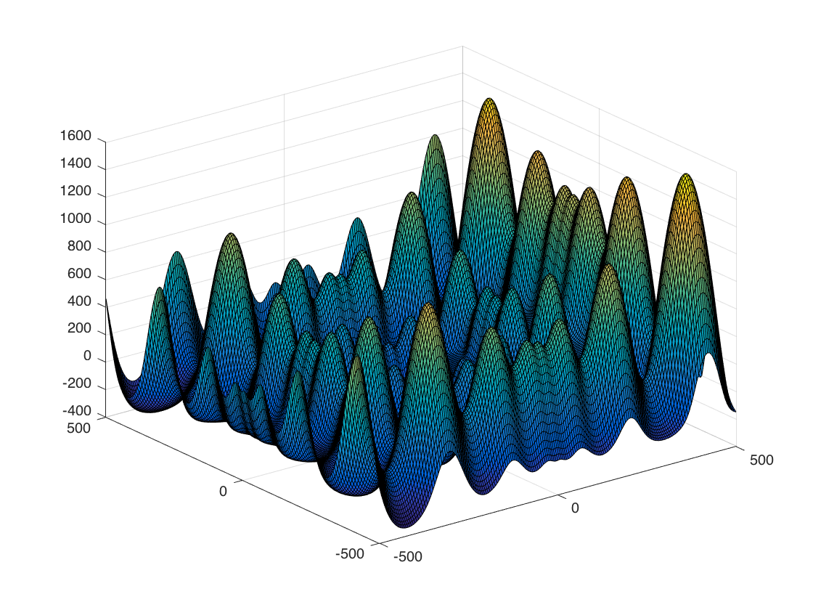
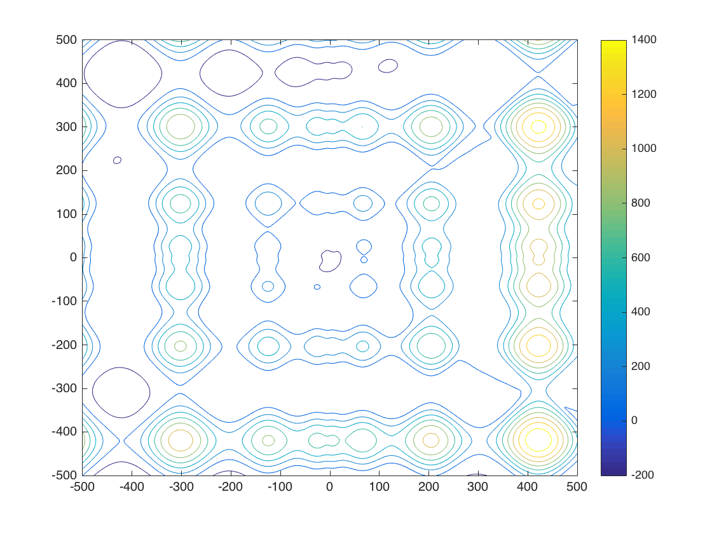
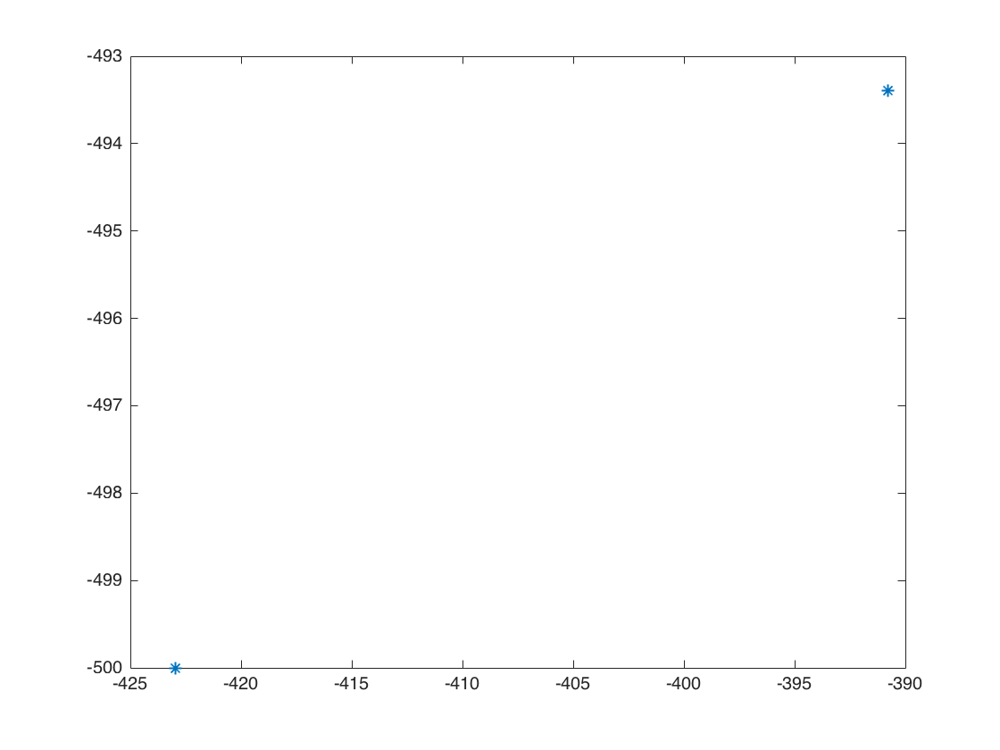
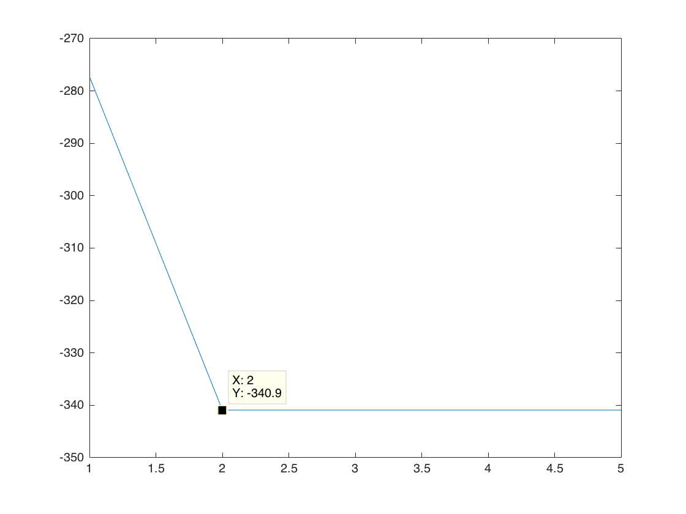
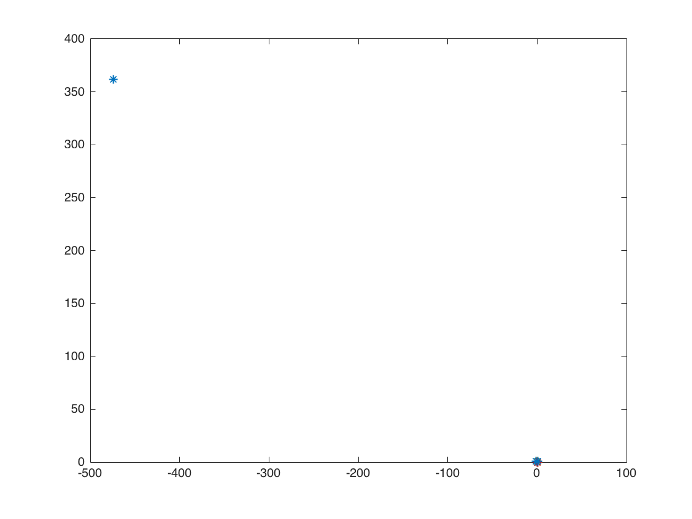
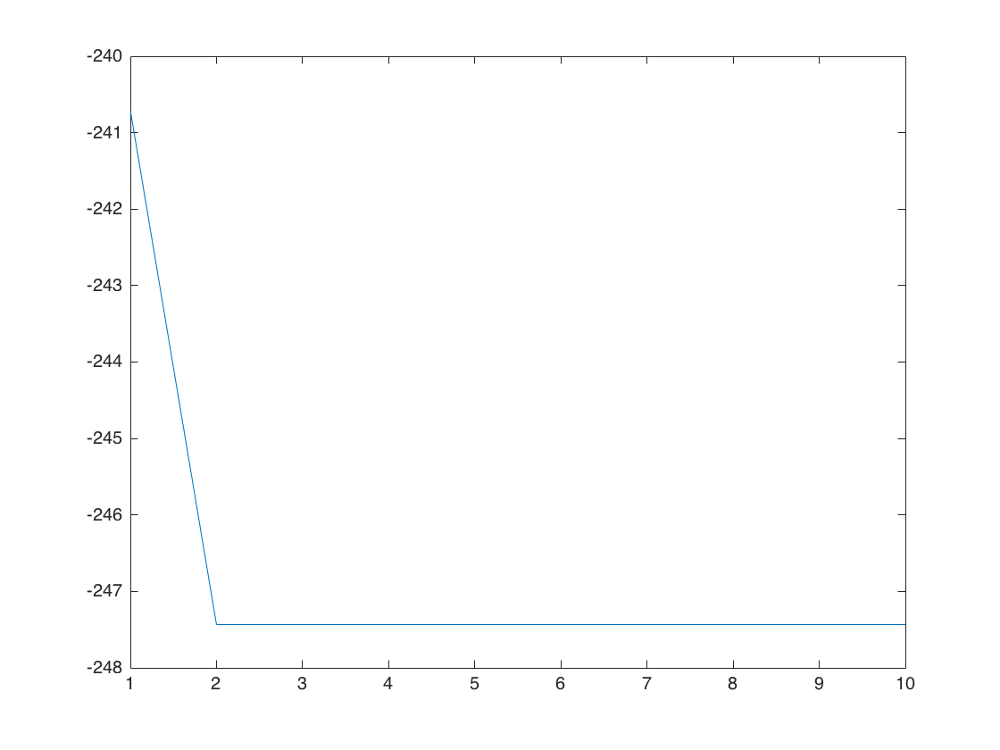

= DCA 0115 - Otimização de Sistemas
Filipe Viana Monteiro <filipevianam@gmail.com>
:toc: left
:toc-title: Sumário

== 1. Resumo

Essa página descreve a implementação de duas técnicas de otimização de sistemas não lineares, sendo elas o algoritmo genético e o algoritmo da nuvem de partículas. Essa atividade foi desenvolvida na disciplina de Otimização de Sistemas ofertada no semestre 2016.1 pelo DCA/UFRN.

== 2. Função Objetivo

A função objetivo a ser minimizada pelas duas técnicas implementadas tem seu gráfico, em 3 dimensões e de contorno, ilustradas abaixo.

O código em Matlab que descreve a função objetivo a ser otimizada pode ser visto abaixo.

[source, matlab]
.objectiveFunction.m
----
include::./codes/objectiveFunction.m[objectiveFunction.m]
----

== 3. Algoritmo da Nuvem de Partículas

O algoritmo da nuvem de partículas é uma técnica de otimização de problemas não lineares inspirada no comportamento e na dinâmica dos movimentos dos pássaros, insetos e peixes. Nessa técnica, a população de partículas é inicializada aleatoriamente, dentro do espaço de busca para a solução ótima, e as velocidades das partículas é calculada pela combinação da velocidade atual da partícula somada a distância dessa partícula a melhor posição já alcançada pela mesma e a distância dessa partícula a melhor posição já alcançada pelo conjunto.

O código em matlab que implementa o algoritmo da nuvem de partículas pode ser visto abaixo.

[source, matlab]
.PSO.m
----
include::./codes/PSO/PSO.m[PSO.m]
----

Para os parâmetros especificados no código acima, a implementação do algoritmo da nuvem de partículas foi capaz de encontrar o que acredita-se ser o menor valor para a função objetivo na área de busca em apenas duas iterações. Abaixo estão os gráficos da melhor posição e seu valor correspondente na função versus iteração que comprovam a efetividade do algoritmo.

== 4. Algoritmo Genético

O algoritmo genético é também uma técnica de otimização de problemas não lineares e é inspirado na teoria da evolução, onde os indivíduos mais aptos tem uma maior probabilidade de reproduzir e gerar descendentes.

Primeiramente, uma população é gerada aleatoriamente dentro do espaço de busca da função e essa população, no caso estudado, nada mais é do que pontos (x,y) dentro da área de busca(-500:500, 500:-500). A aptidão capacidade do indivíduo de reproduzir é dada pelo seu valor na função objetivo, e o indivíduo é tão apto quanto menor for seu valor na função objetivo, já que trata-se de um problema de minimização.

O código abaixo é responsável por normalizar o vetor de aptidão dos indivíduos da população de forma que esse vetor esteja normalizado para valor entre 0 e 1, sendo 1 o indivíduo com melhor aptidão, ou seja, menor valor na função objetivo.

[source, matlab]
.Normaliza.m
----
include::./codes/AG/normaliza.m[normaliza.m]
----

Uma vez que o vetor aptidão está normalizado é possível realizar o sorteio dos indivíduos que serão os pais para a nova geração. Este sorteio segue o método da roleta e é realizado pela função abaixo.

[source, matlab]
.roleta.m
----
include::./codes/AG/roleta.m[roleta.m]
----

Após a seleção dos pais da próxima geração, é hora de gerar os indivíduos da próxima. Nesta fase dois parâmetros são importantes, são eles a porcentagem de crossover e mutação. A reprodução só ocorre para um determinado par de pais caso um número aleatório gerado seja menor que a porcentagem de crossover determinado no programa, em caso positivo os indivíduos da próxima geração serão uma combinação, gerada pela função de crossover, dos pais, já em caso negativo os filhos serão copias idênticas.

A função de crossover converte os pais em seus valores binário e, então, determina um ponto de separação, separando os pais em cabeça e calda. Os filhos gerados serão a concatenação da cabeça do pai 1 com a calda do pai 2 e cabeça do pai 2 com calda do pai 1.

Além da operação de crossover, a função também implementa a mutação que é determinada pela probabilidade de mutação, caso um número aleatório seja menor que esta probabilidade, o bit do filho tem seu valor invertido.

A função crossover que implementa as operações de crossover e mutação pode ser vista abaixo.

[source, matlab]
.crossover.m
----
include::./codes/AG/crossover.m[crossover.m]
----

O script que implementa o algoritmo genético pode ser visto abaixo.

[source, matlab]
.AG.m
----
include::./codes/AG/AG.m[AG.m]
----

Como resultado da execução do algoritmo genético usando os parâmetros descriminados no script acima foi obtido um ponto de mínimo em torno de -247.5 que acontece no ponto (0,0), como visto nos gráficos abaixo, onde o primeiro mostra o indivíduo de melhor aptidão por geração e o segundo plot a melhor aptidão por geração.

== 5. Conclusão

Apesar de ambas a técnicas terem sido aplicadas para minimização de uma mesma função objetivo, o algoritmo da nuvem de partículas foi capaz de encontrar um valor melhor em comparação ao algoritmo genético. Acredita-se que houve um erro lógico de implementação no algoritmo genético, que infelizmente não foi identificado, já que o mesmo tem um nível de dificuldade maior que o algoritmo da nuvem de partículas.

Portanto, acredita-se que o mínimo global da função objetivo ocorre na região do ponto (-423,-500) com valor -340.9, como apontado pelo algoritmo da nuvem de partículas.

